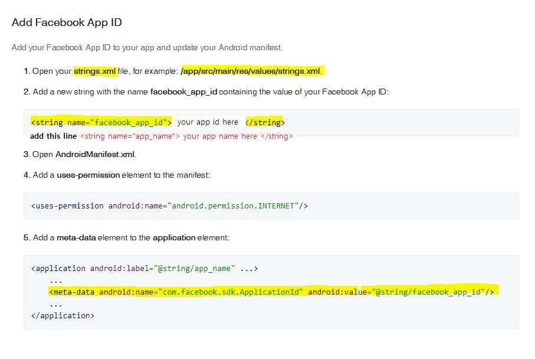
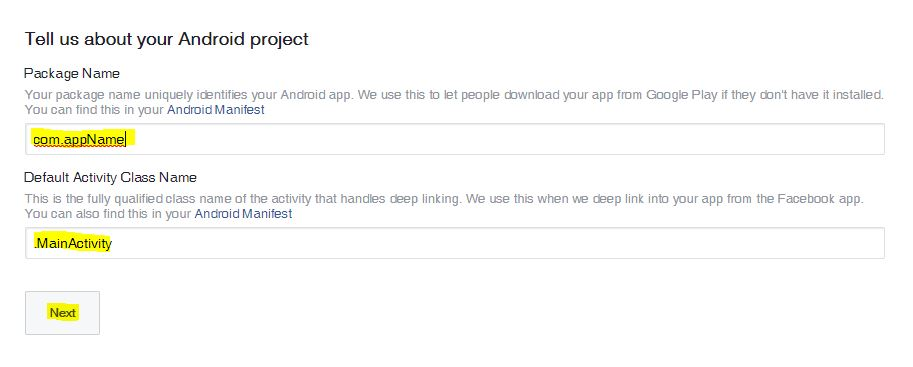
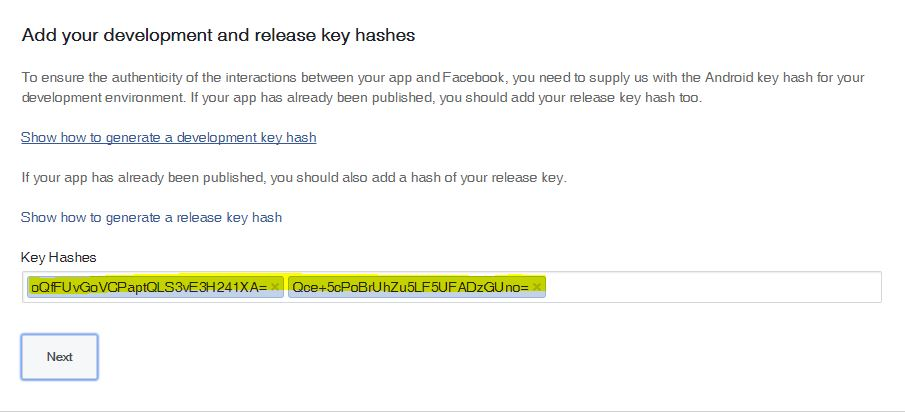

<h1>facebook-login-examples</h1>
<br/>

### STEP1. Install react-native-fbsdk
    npm install --save react-native-fbsdk@0.6.0
> ###### _react-native-fbsdk@0.6.1 an error occured when linking_

<br/>

***

<br/>

### STEP2. Linking

    react-native link react-native-fbsdk


<br/>

***

<br/>

### STEP3. Setting for using Facebook SDK
> **First, you make your facebook app and following this** <br/>
> * Facebook Developers (https://developers.facebook.com/quickstarts/?platform=android) <br/>

 <br/>
 <br/>
 <br/>
<br/>

**Your react-native version is 0.29 or above**

Go to `MainApplication.java` and `MainActivity.java` under `app/src/main/java/com/<project name>/` to complete setup.

In `MainApplication.java`,

Add an instance variable of type `CallbackManager` and its getter.
```java
import com.facebook.CallbackManager;
import com.facebook.FacebookSdk;
import com.facebook.reactnative.androidsdk.FBSDKPackage;
import com.facebook.appevents.AppEventsLogger;
...

public class MainApplication extends Application implements ReactApplication {

  private static CallbackManager mCallbackManager = CallbackManager.Factory.create();

  protected static CallbackManager getCallbackManager() {
    return mCallbackManager;
  }
    //...
```

Override `onCreate()` method
```java
@Override
public void onCreate() {
  super.onCreate();
  FacebookSdk.sdkInitialize(getApplicationContext());
  // If you want to use AppEventsLogger to log events.
  AppEventsLogger.activateApp(this);
}
```

Register sdk package in method `getPackages()`.
```java
private final ReactNativeHost mReactNativeHost = new ReactNativeHost(this) {
    @Override
    protected boolean getUseDeveloperSupport() {
      return BuildConfig.DEBUG;
    }

    @Override
    protected List<ReactPackage> getPackages() {
      return Arrays.<ReactPackage>asList(
          new MainReactPackage(),
          new FBSDKPackage(mCallbackManager)
      );
    }
};
```

In `MainActivity.java`

Override `onActivityResult()` method
```java
import android.content.Intent;

public class MainActivity extends ReactActivity {

    @Override
    public void onActivityResult(int requestCode, int resultCode, Intent data) {
        super.onActivityResult(requestCode, resultCode, data);
        MainApplication.getCallbackManager().onActivityResult(requestCode, resultCode, data);
    }
    //...
```
<br/>

***

<br/>

### STEP4. Use and test this examples
* You can get fb_auth data(token) using **LoginManager** <br/>
* You can get users data(birth,gender,name ...) using **Graph** with token
